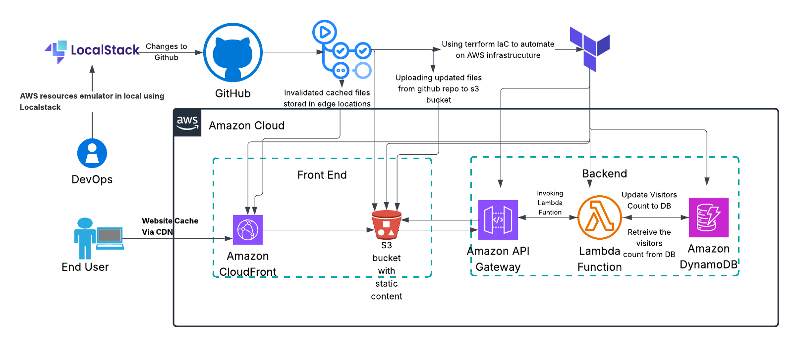

# Cloud-CV Architecture

## System Architecture

The Cloud-CV architecture is built on AWS serverless services, providing a scalable, cost-effective solution for hosting a static portfolio website.

## Components

### Frontend
- **Static Website**: HTML, CSS, and JavaScript files
- **Hosting**: AWS S3 bucket with static website hosting enabled
- **CDN**: CloudFront distribution for global content delivery
- **SSL/TLS**: Automatic HTTPS via CloudFront

### Backend Services
- **Visitor Counter**: AWS Lambda function for tracking page views
- **Database**: DynamoDB table for storing visitor count data
- **API Gateway**: REST API endpoint for Lambda function

### Infrastructure
- **Infrastructure as Code**: Terraform for all AWS resources
- **CI/CD**: GitHub Actions for automated deployment
- **Monitoring**: CloudWatch for logs and metrics

## Data Flow

1. User accesses website via CloudFront
2. CloudFront serves static content from S3
3. Frontend JavaScript calls API Gateway endpoint
4. API Gateway invokes Lambda function
5. Lambda updates DynamoDB with visitor count
6. Response returned to frontend for display

## Security Features

- **IAM Roles**: Least privilege access for Lambda function
- **S3 Bucket Policies**: Restrictive access controls
- **CloudFront OAC**: Origin Access Control for S3
- **HTTPS Only**: Enforced SSL/TLS encryption
- **No Public S3 Access**: All access through CloudFront

